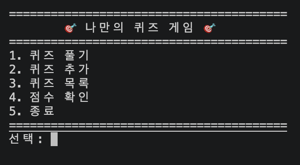
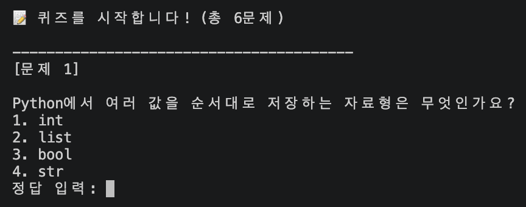
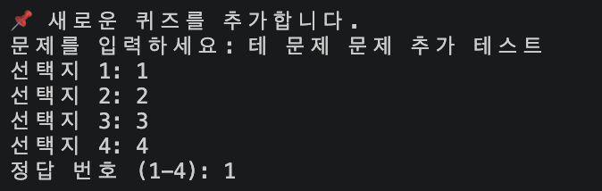
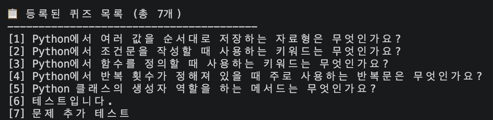
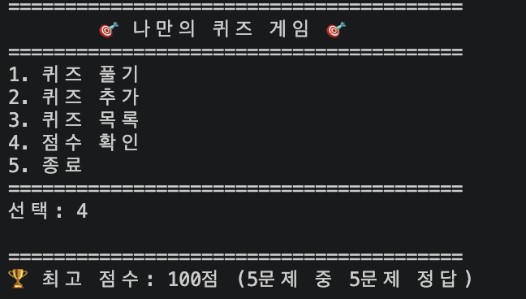

# 🎯 Python Quiz Game

Python 기본 문법과 객체 지향 프로그래밍, JSON 파일 입출력, Git 활용 방법을 학습하기 위해 제작한 콘솔 기반 퀴즈 게임입니다.

사용자는 터미널에서 Python 기초 퀴즈를 풀고, 새로운 문제를 등록하거나 저장된 퀴즈 목록과 최고 점수를 확인할 수 있습니다.

프로그램에서 추가한 퀴즈와 최고 점수는 프로젝트 루트의 `state.json` 파일에 저장되므로, 프로그램을 종료한 뒤 다시 실행해도 데이터가 유지됩니다.

---

## 프로젝트 목표

이 프로젝트를 통해 다음 내용을 학습하고 적용했습니다.

- Python 변수와 기본 자료형 활용
- 조건문과 반복문을 이용한 프로그램 흐름 제어
- 함수의 매개변수와 반환값 활용
- 클래스와 객체를 이용한 역할 분리
- 모듈과 패키지를 이용한 코드 구조화
- JSON 파일을 이용한 데이터 저장과 불러오기
- `try/except`를 이용한 예외 처리
- Git 기능 단위 커밋
- Git 브랜치 생성 및 병합
- GitHub Pull Request 작성
- `clone`, `push`, `pull`을 이용한 원격 저장소 관리

---

## 퀴즈 주제

퀴즈 주제는 **Python 기초 문법**입니다.

이번 미션에서 학습한 변수, 자료형, 조건문, 반복문, 함수, 클래스 등의 내용을 퀴즈로 다시 확인하면서 Python의 기본 개념을 복습하기 위해 해당 주제를 선정했습니다.

프로그램에는 기본 Python 퀴즈 5개가 포함되어 있으며, 사용자가 직접 새로운 퀴즈를 추가할 수 있습니다.

---

## 개발 환경

- Python 3.14.5
- Git
- GitHub
- Visual Studio Code
- macOS

외부 라이브러리는 사용하지 않았으며, Python 표준 라이브러리만 사용했습니다.

사용한 주요 표준 라이브러리:

- `json`
- `pathlib`

---

## 실행 방법

### 1. 저장소 복제

```bash
git clone <GitHub 저장소 URL>
```

### 2. 프로젝트 디렉터리 이동

```bash
cd codyssey-week-2
```

### 3. 프로그램 실행

```bash
python3 main.py
```

---

## 메뉴 구성

프로그램을 실행하면 다음 메뉴가 출력됩니다.

```text
========================================
        🎯 나만의 퀴즈 게임 🎯
========================================
1. 퀴즈 풀기
2. 퀴즈 추가
3. 퀴즈 목록
4. 점수 확인
5. 종료
========================================
선택:
```

---

## 주요 기능

### 1. 퀴즈 풀기

저장된 퀴즈를 순서대로 풀 수 있습니다.

- 문제와 선택지 4개 출력
- 정답 번호 입력
- 정답 및 오답 결과 출력
- 오답인 경우 실제 정답 번호 안내
- 모든 문제를 푼 후 정답 개수와 점수 출력
- 기존 최고 점수보다 높은 경우 최고 점수 갱신
- 퀴즈가 없는 경우 안내 메시지 출력

점수는 정답 비율을 기준으로 100점 만점으로 계산합니다.

```text
점수 = 정답 개수 / 전체 문제 개수 × 100
```

---

### 2. 퀴즈 추가

새로운 퀴즈를 직접 등록할 수 있습니다.

입력 항목:

- 문제
- 선택지 1
- 선택지 2
- 선택지 3
- 선택지 4
- 정답 번호

빈 문제나 빈 선택지는 등록할 수 없으며, 정답 번호는 `1~4` 사이의 숫자만 입력할 수 있습니다.

추가한 퀴즈는 즉시 `state.json`에 저장됩니다.

---

### 3. 퀴즈 목록

현재 등록된 퀴즈 목록을 확인할 수 있습니다.

- 전체 퀴즈 개수 출력
- 퀴즈 번호와 문제 내용 출력
- 기본 퀴즈와 사용자가 추가한 퀴즈 모두 표시
- 등록된 퀴즈가 없는 경우 안내 메시지 출력

---

### 4. 점수 확인

현재까지 기록된 최고 점수를 확인할 수 있습니다.

출력 정보:

- 최고 점수
- 최고 점수 당시 전체 문제 수
- 최고 점수 당시 정답 개수

아직 퀴즈를 풀지 않았다면 안내 메시지가 출력됩니다.

---

### 5. 데이터 저장 및 불러오기

퀴즈 목록과 최고 점수는 프로젝트 루트의 `state.json`에 저장됩니다.

- 프로그램 시작 시 기존 데이터 불러오기
- 저장 파일이 없으면 기본 퀴즈 사용
- 퀴즈 추가 직후 저장
- 퀴즈 플레이 후 최고 점수 저장
- 정상 종료 시 저장
- `Ctrl+C` 또는 입력 스트림 종료 시 가능한 범위에서 저장
- 프로그램 재실행 후 데이터 유지

---

### 6. 입력 및 예외 처리

숫자 입력이 필요한 곳에서 다음 상황을 처리합니다.

- 입력값 앞뒤 공백 제거
- 빈 입력 처리
- 숫자가 아닌 입력 처리
- 허용 범위를 벗어난 숫자 처리
- 올바른 값이 입력될 때까지 재입력

파일 처리 중 발생할 수 있는 다음 상황도 처리합니다.

- `state.json` 파일이 없는 경우
- JSON 형식이 손상된 경우
- 필수 데이터가 누락된 경우
- 퀴즈 데이터 형식이 올바르지 않은 경우
- 최고 점수 데이터가 올바르지 않은 경우
- 파일 읽기 및 쓰기 오류가 발생한 경우

---

## 프로젝트 구조

```text
codyssey-week-2/
├── .gitignore
├── README.md
├── main.py
├── state.json
├── quiz_game/
│   ├── __init__.py
│   ├── quiz.py
│   ├── game.py
│   ├── input_handler.py
│   ├── state_repository.py
│   └── default_quizzes.py
└── docs/
    └── screenshots/
        ├── menu.png
        ├── play.png
        ├── add_quiz.png
        ├── quiz_list.png
        └── score.png
```

`state.json`과 스크린샷 파일은 프로그램 실행 및 제출 준비 과정에서 생성됩니다.

---

## 파일별 역할

### `main.py`

프로그램의 실행 시작점입니다.

`QuizGame` 객체를 생성하고 게임을 실행합니다.

```python
from quiz_game import QuizGame


def main():
    game = QuizGame()
    game.run()


if __name__ == "__main__":
    main()
```

### `quiz_game/__init__.py`

패키지 외부에서 `QuizGame` 클래스를 쉽게 불러올 수 있도록 공개합니다.

### `quiz_game/quiz.py`

개별 퀴즈를 표현하는 `Quiz` 클래스를 정의합니다.

담당 역할:

- 문제, 선택지, 정답 관리
- 입력된 답과 정답 비교
- 퀴즈 데이터를 딕셔너리로 변환
- JSON 데이터를 `Quiz` 객체로 변환
- 퀴즈 데이터 유효성 검사

### `quiz_game/game.py`

게임 전체 흐름을 관리하는 `QuizGame` 클래스를 정의합니다.

담당 역할:

- 메뉴 출력
- 퀴즈 풀기
- 퀴즈 추가
- 퀴즈 목록 조회
- 최고 점수 확인
- 점수 계산
- 프로그램 실행 및 종료 처리
- 저장소 호출

### `quiz_game/input_handler.py`

사용자 입력을 담당합니다.

담당 역할:

- 숫자 입력
- 문자열 입력
- 빈 입력 처리
- 숫자 변환 실패 처리
- 허용 범위 검사
- 재입력 처리

### `quiz_game/state_repository.py`

`state.json` 저장과 불러오기를 담당합니다.

담당 역할:

- 퀴즈 목록 저장
- 최고 점수 저장
- 저장된 데이터 불러오기
- JSON 데이터 검증
- 손상된 파일 예외 처리
- 프로젝트 루트의 저장 파일 경로 관리

### `quiz_game/default_quizzes.py`

프로그램을 처음 실행하거나 저장 파일을 사용할 수 없을 때 제공하는 기본 Python 퀴즈 5개를 관리합니다.

---

## 클래스 구조

### `Quiz`

하나의 퀴즈를 표현하는 클래스입니다.

주요 속성:

| 속성 | 설명 |
|---|---|
| `question` | 퀴즈 문제 |
| `choices` | 4개의 선택지 |
| `answer` | 정답 번호 |

주요 메서드:

| 메서드 | 설명 |
|---|---|
| `is_correct()` | 사용자 정답 확인 |
| `to_dict()` | 객체를 딕셔너리로 변환 |
| `from_dict()` | 딕셔너리를 객체로 변환 |
| `_validate()` | 퀴즈 데이터 유효성 검사 |

### `QuizGame`

게임 전체를 관리하는 클래스입니다.

주요 속성:

| 속성 | 설명 |
|---|---|
| `quizzes` | 현재 등록된 퀴즈 목록 |
| `best_result` | 현재 최고 점수 정보 |
| `repository` | JSON 저장소 객체 |

주요 메서드:

| 메서드 | 설명 |
|---|---|
| `run()` | 게임 실행 |
| `play_quizzes()` | 퀴즈 출제 및 결과 계산 |
| `add_quiz()` | 새로운 퀴즈 등록 |
| `show_quiz_list()` | 퀴즈 목록 출력 |
| `show_best_score()` | 최고 점수 출력 |
| `_load_state()` | 저장 데이터 불러오기 |
| `_save_state()` | 현재 데이터 저장 |

---

## 데이터 파일

데이터는 프로젝트 루트의 `state.json` 파일에 UTF-8 인코딩으로 저장됩니다.

```text
codyssey-week-2/state.json
```

### 저장 데이터 예시

```json
{
    "quizzes": [
        {
            "question": "Python에서 여러 값을 순서대로 저장하는 자료형은 무엇인가요?",
            "choices": [
                "int",
                "list",
                "bool",
                "str"
            ],
            "answer": 2
        }
    ],
    "best_result": {
        "score": 80,
        "correct_count": 4,
        "total_count": 5
    }
}
```

### 필드 설명

| 필드 | 설명 |
|---|---|
| `quizzes` | 등록된 퀴즈 목록 |
| `question` | 퀴즈 문제 |
| `choices` | 4개의 선택지 |
| `answer` | 정답 번호 |
| `best_result` | 최고 점수 정보 |
| `score` | 100점 기준 최고 점수 |
| `correct_count` | 최고 점수 당시 정답 개수 |
| `total_count` | 최고 점수 당시 전체 문제 수 |

아직 퀴즈를 풀지 않은 경우 `best_result`는 `null`로 저장될 수 있습니다.

---

## 기본 퀴즈

프로그램에는 Python 기초 문법을 주제로 한 퀴즈 5개가 기본으로 포함되어 있습니다.

주요 범위:

- Python 자료형
- 조건문
- 함수
- 반복문
- 클래스와 `__init__`

---

## Git 작업 과정

프로젝트는 기능 단위로 변경 이력을 관리했습니다.

주요 작업 내용:

- 프로젝트 초기 구조 설정
- README 초안 작성
- 메뉴 및 종료 기능 구현
- `Quiz` 클래스 구현
- 기본 Python 퀴즈 추가
- 별도 브랜치에서 퀴즈 풀기 기능 구현
- Pull Request를 통한 `main` 브랜치 병합
- 퀴즈 추가 기능 구현
- 퀴즈 목록 조회 기능 구현
- 최고 점수 관리 기능 구현
- JSON 저장 및 불러오기 구현
- `QuizGame` 클래스 책임 분리
- 역할별 Python 모듈 분리
- 패키지 구조 적용
- 사용자 입력 및 파일 예외 처리

사용한 주요 Git 명령어:

```text
git init
git add
git commit
git push
git pull
git checkout
git clone
git merge
```

---

## 브랜치 및 Pull Request

퀴즈 풀기 기능과 파일 구조 리팩터링은 별도의 브랜치에서 작업했습니다.

브랜치 예시:

```text
feature/quiz-play
refactor/split-quiz-game
```

작업 브랜치를 원격 저장소에 올린 뒤 Pull Request를 작성하고, 검토 후 `main` 브랜치에 병합했습니다.

---

## 실행 화면

### 메뉴 화면


### 퀴즈 풀기


### 퀴즈 추가


### 퀴즈 목록


### 점수 확인


## 테스트 항목

- [x] 프로그램 실행 시 메뉴가 정상적으로 출력되는지 확인
- [x] 메뉴에서 `1~5` 사이의 기능을 선택할 수 있는지 확인
- [x] 빈 입력 시 안내 후 재입력되는지 확인
- [x] 문자 입력 시 안내 후 재입력되는지 확인
- [x] 허용 범위를 벗어난 숫자 입력을 처리하는지 확인
- [x] 기본 퀴즈 5개가 정상적으로 출력되는지 확인
- [x] 정답과 오답이 정상적으로 구분되는지 확인
- [x] 퀴즈 결과와 점수가 정상적으로 계산되는지 확인
- [x] 새로운 퀴즈를 추가할 수 있는지 확인
- [x] 추가한 퀴즈가 목록에 표시되는지 확인
- [x] 최고 점수가 정상적으로 갱신되는지 확인
- [x] 프로그램 재실행 후 퀴즈와 점수가 유지되는지 확인
- [x] `state.json`이 없을 때 기본 데이터로 실행되는지 확인
- [x] 손상된 JSON 파일을 처리하는지 확인
- [x] `Ctrl+C` 입력 시 데이터를 저장하고 종료하는지 확인
- [x] 파일 분리 후 모듈 import가 정상적으로 동작하는지 확인

---

## Git 저장소 복제 실습

개발 완료 후 `clone`과 `pull`을 경험하기 위해 다음 과정을 진행합니다.

1. 원격 저장소를 별도의 로컬 디렉터리에 `clone`
2. 복제한 저장소에서 README 일부 수정
3. 변경사항을 `commit`하고 `push`
4. 기존 작업 디렉터리에서 `pull`
5. 원격 변경사항이 정상적으로 반영되었는지 확인

---

## 향후 개선 사항

- 퀴즈 문제 순서 랜덤 출제
- 출제할 문제 수 선택
- 힌트 기능
- 퀴즈 삭제 기능
- 전체 게임 기록 저장
- 날짜와 시간별 점수 히스토리 관리
- 자동 테스트 코드 작성